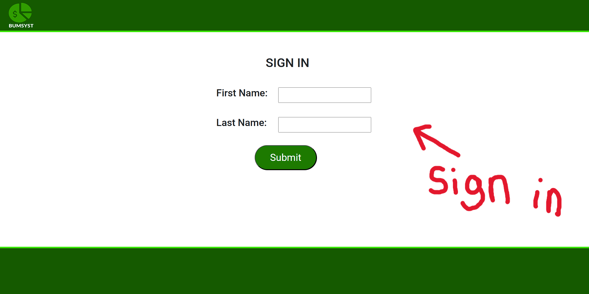
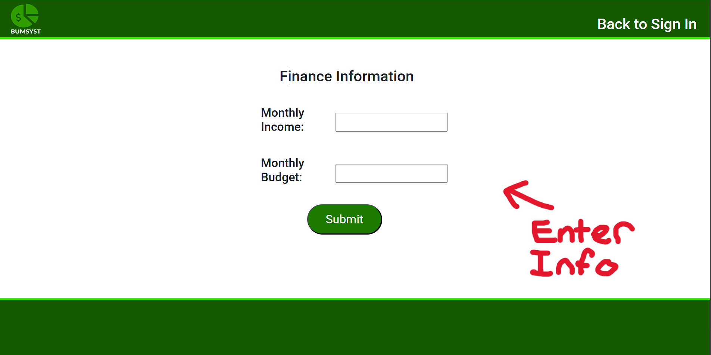
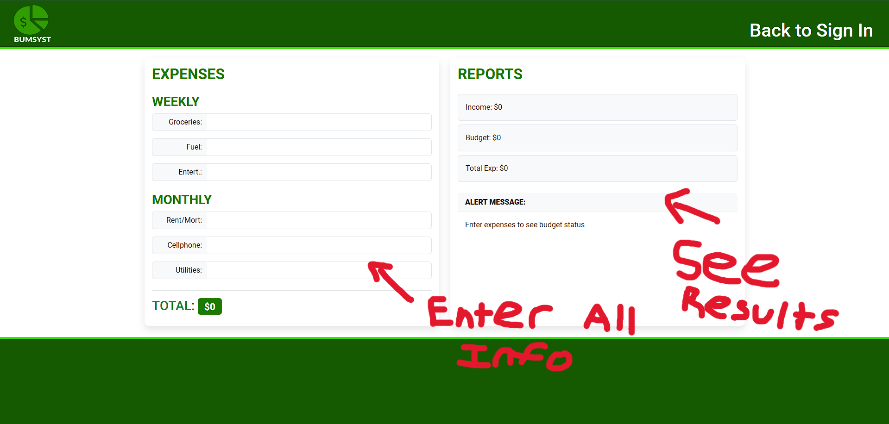

#Budget Managment System (BUMSYST)

## Description

Our team created this web app to help families and households manage their money, and track spending habits. We are all working people, and sometimes money management is hard to keep track of. This website helps solve that problem. By accurately calculating your income and neatly displaying all of your documented spending you are able to more easily track your habits, and perhaps where you could improve financially in the future. 

## Installation

Just visit our website at: https://muthukonar.github.io/group4-project1
## Usage

First, sign in using first and last name. 

Next, input your monthly income, and your monthly budget (Income minus whatever you put into your savings each month)

Finally, input all of your weekly and monthly expenses, and read the results that are neatly organized on the screen!

   

   

   

## Credits

CREATORS AND LINKS TO GITHUBS:

Pechimuthu Konar: https://github.com/muthukonar
Hugh Moore: https://github.com/hughbenmoore
Caleb Colangelo: https://github.com/CalebColangelo
Stanley Bertrand: https://github.com/djsteezybaby

We used Bootstrap CSS, here is their link to an amazing framework: https://getbootstrap.com

